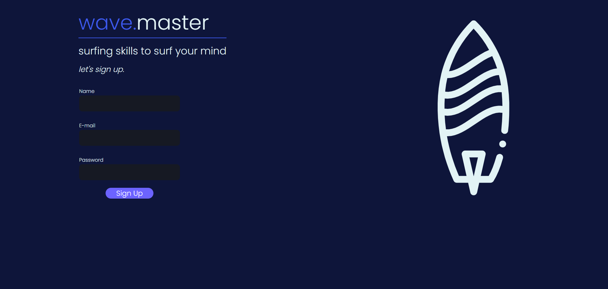

# wave.master - Página de Login animada com ReactJs
## Projeto separado em components

Dividida em dois components, SignUpBox(formulário de registro) e Prancha (svg do ícone da prancha)

- Após finalizar o registro e clicar no button "Sign Up", a variável
